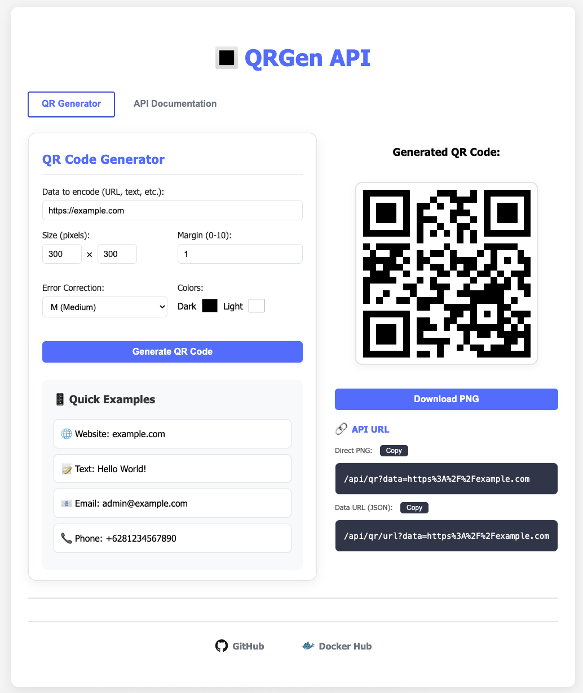

<p align="center">
  
</p>

# QRGen API

<p align="center">
  
</p>

A fast and flexible API for generating customizable QR codes with Node.js and Express.

---

Welcome to **QRGen API**! This project provides a robust and easy-to-use API for generating QR codes on demand. Built for developers, freelancers, and businesses who need reliable QR code generation with advanced customization.

- **Author:** Hifzi ([github.com/hifzi](https://github.com/hifzi))

---

## 🚀 Quick Example

**Request:**
```
http://localhost:8080/api/qr/url?data=example.com&size=300x300&margin=1&errorLevel=M
```

**Response:**
```json
{
  "success": true,
  "data": {
    "url": "data:image/png;base64,iVBORw0KGgoAAAANSUhEUgAA...",
    "size": "300x300",
    "content": "example.com",
    "options": {
      "margin": "1",
      "errorCorrectionLevel": "M"
    }
  }
}
```

## ✨ Features

- ⚡ High-quality PNG QR code generation
- 🎨 Customizable size, margin, error correction, and colors
- 🔒 Secure and robust error handling
- 🌐 CORS enabled for cross-origin requests
- 🖼️ Data URL endpoint for easy embedding
- 🧪 Comprehensive API testing suite
- 🖥️ Web interface for real-time testing

## Table of Contents

- [Installation](#installation)
- [Usage](#usage)
- [Usage Examples](#usage-examples)
- [API](#api)
- [Features](#features)
- [Testing](#testing)
- [Web Interface](#web-interface)
- [Contributing](#contributing)
- [License](#license)

## Installation

You can install and run QRGen API in two ways:

### 1. Node.js (Manual)

1. Clone the repository:
   ```bash
   git clone https://github.com/hifzi/qrgen-api.git
   ```
2. Navigate to the project directory:
   ```bash
   cd qrgen-api
   ```
3. Install the dependencies:
   ```bash
   npm install
   ```

### 2. Docker (Recommended for Easy Setup)

You can run QRGen API instantly using Docker:

```bash
docker run --name qrgen-api -p 8080:8080 -e PORT=8080 hifzirs/qrgen-api:latest
```

- Change the left port (`8080`) to any port you want on your machine.
- The API will be available at `http://localhost:8080` or your local domain.
- For a custom domain (e.g. `qrgen-api.local`), edit your `/etc/hosts` file.

## Usage

To start the server, run one of the following commands:

**Production mode:**
```bash
npm start
```

**Development mode (with auto-reload):**
```bash
npm run dev
```

**Run tests:**
```bash
npm test              # Basic functionality tests
npm run test:enhanced # Enhanced tests with custom options
```

The server will start on `http://localhost:8080`. You can then access the QR code generation endpoints.

## Usage Examples

### Basic QR Code
```
GET /api/qr?data=example.com
```
Creates a 300x300 QR code with default settings.

### High-Security QR Code
```
GET /api/qr?data=sensitive-data&errorLevel=H&margin=3
```
Creates a QR code with high error correction (30% recovery) and extra margin.

### Branded QR Code
```
GET /api/qr?data=company.com&darkColor=%23FF6B35&lightColor=%23F7F7F7&size=500x500
```
Creates a branded QR code with custom orange color and light gray background.

### Compact QR Code
```
GET /api/qr?data=short.ly/abc&size=150x150&margin=0&errorLevel=L
```
Creates a minimal QR code with no margin and low error correction for space-saving.

### URL with Custom Options
```
GET /api/qr/url?data=example.com&size=400x400&margin=2&errorLevel=Q&darkColor=%23000080
```
Returns a base64 data URL for embedding in HTML/CSS.

## API

### Generate QR Code (PNG Image)

**Endpoint:** `/api/qr`

**Method:** `GET`

**Query Parameters:**
- `data`: The data to encode in the QR code (required).
- `size`: The size of the QR code in format "WIDTHxHEIGHT" (optional, default is `300x300`).
- `margin`: The margin size around the QR code (optional, 0-10, default is `1`).
- `errorLevel`: Error correction level (optional, L/M/Q/H, default is `M`).
- `darkColor`: Dark color in hex format (optional, default is `#000000`).
- `lightColor`: Light color in hex format (optional, default is `#FFFFFF`).

**Size Limits:**
- Minimum: `50x50` pixels
- Maximum: `2000x2000` pixels
- Data length: Maximum 4000 characters

**Error Correction Levels:**
- `L`: Low (~7% recovery)
- `M`: Medium (~15% recovery) - Default
- `Q`: Quartile (~25% recovery)
- `H`: High (~30% recovery)

**Example Requests:**
```
http://localhost:8080/api/qr?data=example.com&size=300x300
http://localhost:8080/api/qr?data=Hello%20World&margin=2&errorLevel=H
http://localhost:8080/api/qr?data=example.com&size=400x400&darkColor=%23FF0000&lightColor=%23FFFF00
http://localhost:8080/api/qr?data=test&size=200x200&margin=0&errorLevel=L
```

**Response:**
Returns a PNG image file that can be directly displayed or saved.

### Generate QR Code (Data URL)

**Endpoint:** `/api/qr/url`

**Method:** `GET`

**Query Parameters:**
Same as above.

**Example Request:**
```
http://localhost:8080/api/qr/url?data=example.com&size=300x300
```

**Response:**
```json
{
  "success": true,
  "data": {
    "url": "data:image/png;base64,iVBORw0KGgoAAAANSUhEUgAA...",
    "size": "300x300",
    "content": "example.com"
  }
}
```

### Error Responses

**400 Bad Request:**
```json
{
  "error": "Data parameter is required",
  "example": "/api/qr?data=example.com&size=300x300"
}
```

**500 Internal Server Error:**
```json
{
  "error": "Failed to generate QR code",
  "details": "Error message details"
}
```

## Features

- ✅ High-quality PNG QR code generation
- ✅ Customizable dimensions (50x50 to 2000x2000 pixels)
- ✅ Custom margin control (0-10)
- ✅ Error correction levels (L/M/Q/H)
- ✅ Custom colors (hex format)
- ✅ Support for any text or URL data
- ✅ Proper error handling and validation
- ✅ CORS enabled for cross-origin requests
- ✅ Data URL endpoint for base64 encoded images
- ✅ Scannable QR codes with customizable error correction
- ✅ Cache headers for better performance
- ✅ Web interface for easy testing
- ✅ Comprehensive API testing suite
- ✅ Enhanced testing with custom options

## Testing

The project includes a comprehensive test suite to verify all endpoints and error conditions:

```bash
npm test
```

## Web Interface

A user-friendly web interface is available at `http://localhost:8080` for testing the QR code generation functionality. The interface includes:

- Real-time QR code generation
- Customizable size parameters
- Quick example buttons
- Download functionality
- Error handling display

## Contributing

Contributions are welcome! Please open an issue or submit a pull request.

## License

This project is licensed under the MIT License.